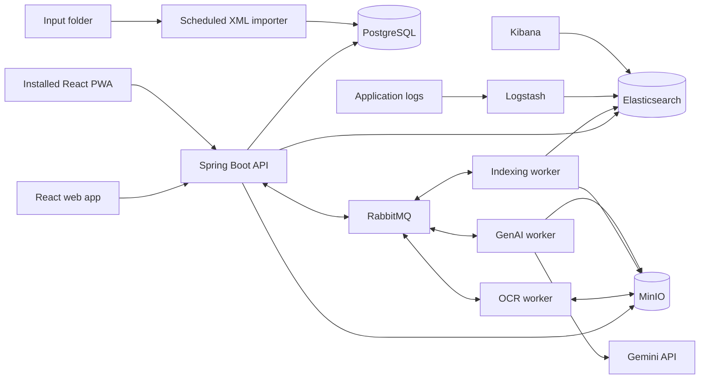

# DocFlow architecture

**Status:** proposed design, incorporating confirmed choices. **Research date:** 9 October 2026. This document describes the intended implementation; no application has been scaffolded, deployed or compatibility-tested yet.

## 1. Confirmed choices

- Repository: **DocFlow**; Java/Spring Boot backend and React frontend in the same repository.
- Deployment: **managed Docker container platform, no VPS**; automatic CI/CD and **scheduled testing/demonstrations**, not continuous hosting. **EUR 10/month maximum for the whole team**, including taxes/usage/AI. Railway is the recommended candidate, subject to a measured trial and account limits.
- Team: **three students**.
- Classification: **multiple labels per document, mandatory user confirmation**; live LLM integration in Sprint 5, not Sprint 1.
- Accounts: **admin-created accounts only**, username-or-email/password login, **no public registration page or endpoint**.
- Additional use case: **automatic document classification using an LLM**.
- Versions: latest LTS when available; otherwise latest stable compatible releases, excluding previews.
- Accepted defaults: owner-only document access, admin-maintained seven-label taxonomy, Gemini provider and Railway scheduled sessions with one hosting administrator.
- Mobile deliverable: **React PWA**, assumed sufficient by the team; course acceptance is not explicitly documented. No separate native/Capacitor project.
- Infrastructure: pinned MinIO source build accepted; **Elasticsearch, Logstash and Kibana in containers both locally and during cloud sessions**. No continuous cloud operation.

Recommend a layered REST application with separate OCR, indexing and GenAI worker applications, plus a scheduled batch application. PostgreSQL owns structured data, MinIO stores files, Elasticsearch provides search, and RabbitMQ connects asynchronous processing. The course diagram explicitly specifies a monorepo with subprojects.

## 2. Course requirements and evidence

| Course requirement | Design response |
| --- | --- |
| JDK LTS >=25, Spring Boot >=3.5/4 | Java 25 LTS and Spring Boot 4.1.1 |
| REST, PostgreSQL ORM, repository pattern | Spring MVC, Spring Data JPA, Hibernate, Flyway |
| Separate business and persistence entities; mapping framework | HTTP DTOs, business models, JPA entities, MapStruct |
| Business components through interfaces; DI and validation | Application services, ports/adapters, constructor injection, Jakarta validation |
| Upload, edit, delete, metadata, tags | Document API and React dashboard/detail views |
| Full-text and fuzzy search | Elasticsearch projection and search service agent |
| RabbitMQ and separate worker applications | OCR, indexing and GenAI applications |
| PDF storage/OCR | MinIO in Compose from Sprint 1; PDFBox rasterization and Tesseract |
| Generated summary persisted in PostgreSQL | Worker result consumed and saved by API |
| Additional entities, not only 1:1 | Classification runs, categories, predictions, assignments and feedback |
| Separate webserver container, localhost port 80 | Nginx serving React and proxying `/api` |
| Smartphone app in Sprint 5 | React PWA, assumed sufficient by team; PDF does not specify native/PWA |
| Sprint 4 ELK in containers | Elasticsearch, Logstash and Kibana locally and in cloud sessions |
| Separate daily XML batch application | Access-log import, database persistence, configurable paths/schedule, archiving |
| Docker Compose throughout | Reproducible local/grading environment |
| Coverage >70%, mocked unit tests, integration tests | Proposed 80% application line-coverage gate plus critical-path tests |
| GitFlow, PRs, Kanban, CI/CD, documentation | GitHub branches/Actions/Projects and design/test documentation |

The rubric assigns 20 points each to functionality, non-functional requirements, architecture, development workflow and code-review knowledge. Containerized deployment alone is 10 points. Document decisions, diagrams, testing, lessons learned and tracked work. Every member should understand the complete system.

### Requirement details and assumptions

- The course architecture diagram includes a mobile client and a Docker Compose monorepo; its omission of Kibana/Logstash does not override the later sprint instructions.
- Sprint 1 includes the additional use case and extra entities. Implement its domain/API/persistence foundation then; the team confirms live LLM classification comes later, in Sprint 5.
- Sprint 4 requires MinIO, OCR and ELK in containers. ELK means Elasticsearch, Logstash and Kibana; all three run locally and in scheduled cloud sessions. The indexing worker is explicitly separate even though the course diagram associates indexing with GenAI.
- Sprint 5 requires a smartphone app generated with AI coding tools, with "smartphone app is available and working" as a must-have. No PWA/native distinction is given. **Team assumption: an installable PWA satisfies this requirement.** This is not a claim of lecturer confirmation.
- Sprint 6 requires a separate daily scheduled XML importer with configurable schedule/folders/patterns and archiving. No continuous cloud-uptime requirement is stated, and the team explicitly excludes it.
- The grading matrix scores the web frontend, core use cases and the additional use case; it has no dedicated mobile/PWA/native score. This does not remove the Sprint 5 must-have.

The course's use-case suggestions endorse LLM classification with a Document/DocumentType many-to-many relationship. The confirmed team is three students (some course material mentions two).

## 3. Component architecture



| Application | Responsibility and ownership |
| --- | --- |
| API | Authentication, document/category/classification workflows, search, status, result consumers and outbox; owns document/classification tables |
| OCR worker | Fetch PDF, render pages, recognize text, save text and publish result; no document-table writes |
| Indexing worker | Version-aware upserts/deletes of Elasticsearch projections |
| GenAI worker | Separate summary/classification handlers, provider calls and structured-output validation; publish results, no document-table writes |
| Batch application | External XML access-log import; owns an `audit` schema in the same PostgreSQL instance |
| React/mobile clients | Public API consumers; no direct database, broker or private-store access |

One PostgreSQL instance is sufficient. Keep table/schema ownership explicit. Share versioned message contracts and small infrastructure helpers, not JPA entities or a common business model across applications.

### Internal layering

`Controller -> application/business service -> repository/service-agent interface -> adapter`

This implements the welcome slide's three layers: Webservice Facade (`api`), Business Layer (`application` plus `domain`), and Data Access Layer (`persistence` and external adapters). These packages are not four separate architectural tiers.

- Controllers handle HTTP, DTOs and transport validation.
- Business services enforce permissions, rules, workflows and transaction boundaries using business models.
- Persistence adapters map business models to/from JPA entities. Neither controllers nor business components use JPA entities directly.
- External service agents hide MinIO, Elasticsearch, RabbitMQ and Gemini behind interfaces.
- Use MapStruct and constructor injection. Translate adapter errors into layer-specific exceptions and consistent HTTP problem responses.

### Processing flow

1. Authenticate and validate file size/type/readability. Generate an object key; the supplied filename is metadata only.
2. Store the PDF in MinIO. In one database transaction create its metadata, processing state and an outbox event. Return `202 Accepted` with document ID/status URL after storage and commit succeed.
3. An outbox dispatcher publishes `DocumentUploaded.v1` with publisher confirms, marking delivery only after confirmation.
4. OCR rasterizes PDF pages with PDFBox, runs Tesseract with limits/timeouts, saves text under a deterministic versioned key and publishes `OcrCompleted.v1` before acknowledging input.
5. The API idempotently consumes the OCR result, persists its text reference and creates separate indexing, summary and classification requests through the outbox. Classification includes allowed category IDs/descriptions and taxonomy revision.
6. Separate queues drive indexing and GenAI handlers. Summary/classification failures must not prevent search or each other's results.
7. Worker results update database status through API result consumers. React polls only while work is active.

Use a durable topic exchange, dedicated durable queues, persistent messages, manual acknowledgements, bounded retries/backoff and dead-letter queues. Messages carry job/document IDs, content/schema versions, object keys and correlation IDs, not PDF bytes. Delivery is **at least once**, not exactly once.

Store consumed-event markers and API business updates in the same transaction. Make worker effects idempotent: deterministic OCR keys and versioned Elasticsearch writes. Save completed GenAI results by job ID before publishing, allowing reuse on redelivery; a crash can still cause a repeated provider call, so bound retries and costs.

Track OCR/indexing/summary/classification states independently, with attempts and last error. Recover stale jobs. Invalid files fail visibly; transient outages retry; permanent errors enter a dead-letter queue.

There is no transaction spanning MinIO and PostgreSQL: compensate orphan uploads after database failure and reconcile unreferenced objects periodically. Deletion creates a database tombstone and cleanup events; immediately hide the document from clients. Content versions prevent late results from resurrecting it. Indexing must apply version-aware deletion/upserts, and file cleanup waits until outstanding processing is settled.

Search is eventually consistent and rebuildable from PostgreSQL and extracted text. Support pagination, fuzzy/full-text queries and category filters. Enforce permissions when returning search hits. If Elasticsearch fails, report search unavailability while ordinary document listing remains usable.

## 4. LLM classification domain

Classification must be a distinct workflow beyond the already-required summaries and tags. **Confirmed:** controlled multi-label categories with mandatory human acceptance/correction. The supplied course suggestions explicitly propose LLM classification with a many-to-many Document/DocumentType relationship. `Category` in this design implements that DocumentType concept; it is separate from free-form tags.

| Entity | Relationship / relevant fields |
| --- | --- |
| Document | Owner, title, original key, content version, timestamps |
| Tag / DocumentTag | Required free-form tagging; many-to-many |
| Category | Name, description, active flag, taxonomy revision |
| ClassificationRun | Many runs per document; model/prompt/taxonomy/content versions, status/time |
| ClassificationPrediction | Many per run; category, suggested confidence, short rationale/evidence |
| DocumentCategory | Accepted many-to-many assignments; source, approving user |
| ClassificationFeedback | Run/document, reviewer, accepted/rejected/corrected result, timestamp |
| User | ID, normalized unique username/email, password hash, USER/ADMIN role, enabled flag, must-change-password flag and token version |
| ProcessingJob / OutboxEvent / ProcessedEvent | Processing state, reliable dispatch, deduplication |
| AccessLogEntry / BatchImport | External access event and imported-file checksum/status |

Workflow: upload -> OCR -> classification -> **awaiting user review** -> user selects/confirms labels -> persist accepted assignments -> update search projection. Predictions remain separate from accepted assignments. No confidence threshold can auto-approve labels. Users may reject all suggestions, choose existing alternatives, or confirm multiple labels. Category filters use accepted labels only. Reclassification leaves previously confirmed assignments unchanged until another explicit confirmation. Owners review their own documents; account administration alone does not grant access to other users' document contents. Admins maintain category definitions.

### Suggested initial document types

| Type | Description/examples |
| --- | --- |
| Invoice | Amount requested for goods/services, tuition invoice |
| Receipt | Proof of payment or purchase |
| Contract | Rental, employment or service agreement |
| Certificate | Enrollment, qualification, attendance or insurance certificate |
| Official correspondence | Decisions, notices and formal letters from institutions |
| Study material | Lecture slides, assignments and study notes |
| Report | Project, technical or inspection report |

These seven labels are the accepted initial taxonomy, editable by the administrator. They can overlap: a formal tuition invoice may be both Invoice and Official correspondence. Keep definitions in the taxonomy, allow zero accepted labels (Unclassified is a UI state), and use ordinary tags for topics such as housing or employment. Start with English/German PDFs.


Allow only known category IDs, validate structured output, reject malformed/duplicate/excessive predictions and permit an unclassified result. Model confidence is not a calibrated probability. Treat document text as untrusted data; it must not authorize operations or create categories. Use distinct prompts/contracts for summary and classification.

Sprint 1 includes category CRUD, assignments, additional entity relationships, mappings, business rules, API and a classifier interface. Use deterministic fixtures in tests and clearly identify unimplemented AI behavior. Live classification, the GenAI worker and the complete review workflow arrive in Sprint 5, as confirmed by the team. Do not require an LLM account for Sprint 1.

### Proposed API

- `POST/GET /api/v1/documents`; `GET/PATCH/DELETE /api/v1/documents/{id}`.
- `GET /api/v1/documents/{id}/content` and `/processing`.
- `GET /api/v1/search?q=...&categoryId=...&page=...`.
- `GET/POST /api/v1/categories`; `PATCH /api/v1/categories/{id}`.
- `POST/GET /api/v1/documents/{id}/classification-runs`.
- `POST /api/v1/classification-runs/{id}/feedback`.
- `PUT /api/v1/documents/{id}/categories`, tag-management endpoints and authenticated retries.
- `POST /api/v1/auth/login` with `{login, password}`; `GET /api/v1/auth/me`; `POST /api/v1/auth/logout`; `PUT /api/v1/auth/password`.
- Admin-only `POST/GET /api/v1/admin/users`, `PATCH /api/v1/admin/users/{id}` and `POST /api/v1/admin/users/{id}/reset-password`. No registration endpoint.

Document permissions, pagination, upload limits, concurrency conflicts and error responses in OpenAPI. Keep an exported OpenAPI snapshot and example `.http` requests. The course explicitly makes server-code generation optional.

## 5. Version baseline

Prefer LTS runtimes. Most frontend libraries and Spring's community releases do not offer an equivalent LTS designation: select maintained stable versions. Preserve Spring Boot's tested dependency set instead of upgrading each transitive dependency independently. These versions are verified published releases, not a successfully tested application combination. Pin exact build dependencies, lockfiles and container digests during scaffolding.

### Java

| Component | Proposed version | Notes |
| --- | --- | --- |
| Eclipse Temurin JDK | **25.0.4.1+1 (Java 25 LTS)** | Latest LTS baseline |
| Maven + Wrapper | **3.10.0** | Stable; Maven 4 RC excluded |
| Spring Boot | **4.1.1** | Parent/BOM; 4.2 milestones excluded |
| Spring Framework / MVC | **7.0.9** | Boot-managed |
| Spring Data train | **2026.0.1** | Boot-managed JPA repositories |
| Hibernate ORM / Validator | **7.4.5.Final / 9.1.3.Final** | Persistence / Jakarta validation |
| Spring Security | **7.1.1** | Boot-managed |
| Spring AMQP | **4.1.1** | RabbitMQ integration |
| Spring Batch | **6.0.5** | Scheduled import job |
| Flyway | **12.4.0** | Include PostgreSQL support module |
| PostgreSQL JDBC | **42.7.13** | Boot-managed |
| Jackson BOM / Logback | **3.1.5 / 1.5.38** | JSON / logging; Boot-managed |
| MapStruct + processor | **1.6.3** | Stable; 1.7 beta excluded |
| springdoc OpenAPI WebMVC UI | **3.1.1** | Boot 4 generation |
| Apache PDFBox | **3.0.8** | PDF parsing and rasterization |
| MinIO Java SDK | **9.0.3** | Verify chosen server/client combination |
| Elasticsearch Java client | **9.4.5** | Boot-managed; newer 9.x server compatibility, avoid newer-only APIs |
| Resilience4j core retry/circuit-breaker | **2.4.0** | Programmatic use; do not assume Boot 3 starter compatibility |
| Gemini adapter | Spring RestClient | Framework-managed; no extra AI SDK needed |
| Gemini model | **gemini-3.8-flash**, proposed | Stable Flash; configurable, account availability/cost to verify |

Use Boot starters for MVC, JPA, validation, security, AMQP, actuator, testing and batch as appropriate. Spring AI is teaching material but not an explicit framework requirement in the supplied brief; direct HTTP keeps the service agent small. Revisit after reading the Spring AI handout.

### Frontend, mobile and tests

| Component | Proposed version |
| --- | --- |
| Node.js | **24.21.0 LTS**; Node 26 is not yet LTS on the research date |
| React / React DOM / corresponding type packages | **19.3.0** |
| TypeScript | **6.0.3**, compatibility exception |
| Vite / React plugin | **8.3.4 / 6.1.2** |
| React Router DOM | **7.18.4** |
| TanStack React Query | **5.104.1** |
| ESLint / typescript-eslint | **10.12.0 / 8.71.1** |
| Hooks / Refresh lint plugins | **7.1.1 / 0.5.7** |
| Prettier | **3.9.9** |
| Vitest / matching V8 coverage package | **5.0.3** |
| React Testing Library / jsdom | **16.3.3 / 30.1.2** |
| Playwright | **1.64.0** |
| JUnit Jupiter / Mockito | **6.0.3 / 5.23.0**, Boot-managed |
| Testcontainers | **2.0.5**, Boot-managed |
| JaCoCo Maven plugin | **0.8.15** |
| Maven compiler / Surefire / Failsafe | **3.15.0 / 3.5.6 / 3.5.6** |
| vite-plugin-pwa | **1.3.0** | Generates manifest + service worker (Workbox); 2.0.0 published within days of the research date, reassess at scaffolding |

TypeScript **7.0.2** is the newest stable observed, but typescript-eslint 8.71.1 declares `>=4.8.4 <6.1.0`. Use 6.0.3 until the lint ecosystem supports 7. This is not an LTS claim. Use npm and a committed lockfile with `npm ci`; record the bundled npm version when scaffolding the selected Node build. CSS Modules, fetch and local React state are adequate; React Query handles server state and polling. No additional UI framework or global state library is necessary initially.

### Infrastructure

| Component | Proposed version / policy |
| --- | --- |
| PostgreSQL | **18.6** in the local and hosted PostgreSQL containers |
| RabbitMQ | **4.3.6**; reassess community support before retakes |
| Elasticsearch / Kibana / Logstash | **9.5.5**, matched server stack; verify container artifacts during build |
| Nginx | **1.30.5 stable branch** |
| Tesseract | **5.5.3**, pinned English/German language data |
| MinIO community server | **RELEASE.2025-10-15T17-29-55Z**, source build accepted by the team |
| Docker Engine / Compose | **29.9.0 / 5.6.0**, stable tooling baseline |
| Docker Desktop | Supported workstation release bundling suitable Engine/Compose; no application dependency on a specific Desktop patch |

PDFBox replaces Ghostscript for rasterization; invoke Tesseract with argument arrays, not shell-assembled commands. Bound page count, memory, temporary files and process time; begin with one OCR job at a time. No Tess4J dependency is needed in this approach.

**MinIO exception:** its official community repository is archived and its latest listed release is source-only. Do not assume an available maintained `minio/minio:latest` image. Build the pinned source release, preserve its notices, and keep the course instance private. The team has accepted this source-build approach; pin the build toolchain and resulting image digest during implementation. [Repository](https://github.com/minio/minio), [release/build instructions](https://github.com/minio/minio/releases/tag/RELEASE.2025-10-15T17-29-55Z).

### Version evidence

- [Temurin releases](https://adoptium.net/temurin/releases/), [Node LTS schedule](https://github.com/nodejs/Release), [Spring Boot requirements](https://docs.spring.io/spring-boot/system-requirements.html).
- Exact managed Java versions: [Spring Boot 4.1.1 BOM](https://repo.maven.apache.org/maven2/org/springframework/boot/spring-boot-dependencies/4.1.1/spring-boot-dependencies-4.1.1.pom). Other Java versions: publisher artifact metadata under [Maven Central](https://repo.maven.apache.org/maven2/), with milestone/RC releases excluded.
- [MapStruct](https://mapstruct.org/documentation/reference-guide/), [springdoc](https://springdoc.org/), [RabbitMQ](https://www.rabbitmq.com/release-information), [PostgreSQL](https://www.postgresql.org/docs/release/), [Elastic releases](https://www.elastic.co/docs/release-notes), [Elastic client compatibility](https://www.elastic.co/docs/reference/elasticsearch/clients/java).
- [Nginx changes](https://nginx.org/en/CHANGES-1.30), [Tesseract releases](https://github.com/tesseract-ocr/tesseract/releases), [Gemini models](https://ai.google.dev/gemini-api/docs/models), [Docker Engine](https://github.com/moby/moby/releases), [Compose](https://github.com/docker/compose/releases).
- npm versions and engine/peer requirements were checked directly at `https://registry.npmjs.org/<package>/latest`, e.g. [React](https://registry.npmjs.org/react/latest), [Vite](https://registry.npmjs.org/vite/latest), [typescript-eslint](https://registry.npmjs.org/typescript-eslint/latest). These endpoints move; the table records the research-date snapshot.

## 6. Recommended directory hierarchy

```text
DocFlow/
  README.md
  LICENSE
  .gitignore
  .env.example
  docker-compose.yml               # Complete local/grading environment
  docker-compose.dev.yml           # Optional developer overrides
  deployment/                      # Platform service configs and start/stop runbook
    railway/                       # One configuration per deployed service
  .github/
    workflows/ci.yml
    workflows/release.yml
    dependabot.yml
  backend/
    pom.xml                        # Parent/aggregator and central versions
    mvnw
    mvnw.cmd
    .mvn/wrapper/
    message-contracts/             # Queue envelopes/payloads, no JPA entities
    adapters/
      messaging/
      object-storage/
    apps/
      api/
        pom.xml
        Dockerfile
        src/main/java/at/fhtw/docflow/
          document/
            api/                   # Controllers, DTOs, HTTP mapping
            application/           # Use cases and ports
            domain/                # Business models and rules
            persistence/           # JPA entities, repositories, mapping
          classification/          # Same feature/layer pattern
          category/
          tag/
          identity/
          processing/              # Results, jobs, outbox
          integration/             # Search/storage service agents
          configuration/
        src/main/resources/
          application.yml
          db/migration/
        src/test/
      ocr-worker/
        pom.xml
        Dockerfile
        src/main/
        src/test/
      indexing-worker/
      genai-worker/                # Summary and classification handlers
      batch-worker/                # Own audit-schema migrations
    integration-tests/
  frontend/
    package.json
    package-lock.json
    .node-version
    vite.config.ts
    tsconfig.json
    Dockerfile                     # Node build -> Nginx runtime
    public/
    src/
      app/                         # Router, providers, layout
      features/
        documents/
        search/
        categories/
        classification/
        authentication/
      shared/
        api/
        components/
        styles/
    tests/
    public/icons/                  # Install icons; manifest + service worker generated by vite-plugin-pwa
  infra/
    nginx/default.conf
    rabbitmq/definitions.json
    minio/Dockerfile
    elasticsearch/
    logstash/                      # Pipeline and bounded buffering config
    kibana/                        # Config and exported dashboards
  contracts/
    openapi.yaml
    events/
    access-log.xsd
  tests/
    e2e/
    fixtures/documents/
    fixtures/access-logs/
    http/
  scripts/                         # ZIP generation, smoke tests, reindexing
  docs/
    architecture.md
    adr/
    testing.md
    deployment.md
    lessons-learned.md
```

This is the intended tree, not a set of created files. Maven builds Java and npm builds React; a monorepo needs neither Nx/Turborepo nor one package manager for both. Add shared modules only when real reuse exists. Each Java application has the usual Maven source/test tree.

Use repository-root Docker build contexts when Java services need sibling modules. Shared contracts, parent POM and adapter changes must rebuild affected services. Keep course downloads, secrets, uploaded files, build outputs and IDE files outside Git.

## 7. Managed Docker deployment and budget

### Local/grading environment

`docker compose build` and `docker compose up` must start the full required stack. Nginx publishes port 80 for `http://localhost/`, serving React and proxying `/api`. Expose the API on host 8080 for the Sprint 5 check; document the discrepancy with the diagram's 8081.

Use named volumes for PostgreSQL, MinIO, RabbitMQ and Elasticsearch; health checks and startup retries; configurable XML input/archive mounts. Developer profiles may save resources, but the final grading instructions must start all required services. From Sprint 4, include Elasticsearch, Logstash and Kibana as separate services in the default local/grading stack and in cloud sessions.

### Platform comparison (9 October 2026)

The team confirmed that cloud availability is needed only for scheduled testing and demonstrations. No VPS is wanted. Prices below are advertised USD prices; tax, conversion and external AI are additional unless explicitly included. None of these offers establishes an always-on, complete-stack deployment below EUR 10.

| Platform | Relevant capabilities and price | Assessment |
| --- | --- | --- |
| **Railway Hobby** | Docker services, private networking and persistent volumes. $5 monthly minimum includes $5 usage; RAM $10/GB-month, CPU $20/vCPU-month, volumes $0.15/GB-month, egress $0.05/GB. | **Recommended for short scheduled sessions**, with measured usage and spending controls. $5 is not a flat price for unlimited containers. |
| **Northflank** | Custom Dockerfiles, services, databases and cron. Free Sandbox includes two services, one database and two cron jobs. Paid 512 MB service: $5.40/month; 1 GB: $12/month. | Good managed alternative, but the free allowance does not cover this stack and paid always-on services exceed the cap. |
| **Koyeb** | Free instance has 512 MB, cannot run as a worker or attach a persistent volume. Paid 1 GB Eco compute is $5.36/month. | Useful for a small API; not a free home for the required persistent infrastructure and workers. |
| **Azure Container Apps + student credits** | Managed container platform; eligible students can receive $100 credit valid for 12 months without a credit card. | Possible credit-funded alternative, but eligibility, regional quotas, stateful storage and total cost need a separate validation. Credits are temporary, not a recurring EUR 10 hosting plan. |

Sources: [Railway pricing](https://docs.railway.com/pricing), [Northflank pricing](https://northflank.com/pricing), [Koyeb instance limits/prices](https://www.koyeb.com/docs/reference/instances), [Azure Container Apps](https://learn.microsoft.com/en-us/azure/container-apps/overview), [Azure for Students](https://azure.microsoft.com/en-us/free/students/).

### Recommended Railway layout

Keep all source code in DocFlow. Deploy each application Dockerfile as a separate service in one project/region. Railway maps Compose concepts to individual services; it does **not** execute the Compose file directly. Keep Compose as the portable local/grading definition. [Compose migration guide](https://docs.railway.com/guides/docker-compose).

| Service | Exposure | Persistent data |
| --- | --- | --- |
| React/Nginx | Public HTTPS; `/api` proxies to the API | None; static files built into image |
| Spring Boot API | Private; both browser and installed PWA use the Nginx `/api` proxy | PostgreSQL and MinIO through private endpoints |
| PostgreSQL | Private | Dedicated volume |
| RabbitMQ | Private; management UI not public | Dedicated volume for durable queues |
| MinIO | Private; browser downloads stream through API | Dedicated volume |
| Elasticsearch | Private, single node | Dedicated volume |
| OCR, indexing and GenAI | Three private worker services | Temporary work files; durable results in MinIO/database |
| XML batch | Separate scheduled application | Dedicated input/archive volume; see section 8 |
| Logstash | Private ingestion endpoint; separate container in every full session | Bounded memory buffer; diagnostic logs may be lost on shutdown |
| Kibana | Separate container; authenticated team-only access for demonstrations | Saved objects in Elasticsearch |

The same Nginx image serves the React build locally and online; a second frontend provider is unnecessary. Configure SPA fallback to `index.html`, an API proxy, upload/time-out limits and runtime upstream resolution. Browser code uses relative `/api` URLs and never private hostnames. The installed PWA uses the same public origin and `/api` path, so no separate mobile API endpoint is needed. Bind public web services to `0.0.0.0` and the platform's assigned port; keep credentials in backend environment secrets. A provider-generated domain avoids buying a domain.

Start with a small synthetic document collection and OCR concurrency one. Measure JVM/native memory, Elasticsearch startup and indexing, PDF rasterization, queue recovery and disk persistence in the first hosted spike. These have not yet been tested on Railway. A managed container host does not remove responsibility for database upgrades, backups or application recovery.

Five volumes cover PostgreSQL, RabbitMQ, MinIO, Elasticsearch and the batch folder. Railway currently documents ten volumes per Hobby project and a default 5 GB volume size. Verify account limits before provisioning. Treat container filesystems outside volumes as disposable. Back up original documents and PostgreSQL off-platform and verify restoration. [Volume limits](https://docs.railway.com/volumes/reference).

Plan for one billing/platform owner on Hobby, with all three students collaborating through GitHub and the controlled CI/CD workflows. Railway reserves workspace collaboration for Pro/Enterprise; do not assume three full workspace seats on Hobby or share a personal login. Verify project-level access separately. If all three need workspace administration, the $20 Pro minimum exceeds this budget. [Workspace access](https://docs.railway.com/projects/workspaces), [plan policy](https://docs.railway.com/pricing/plans).

### Session budget and shutdown

A planning example, **not a benchmark or guaranteed bill**: 30 running hours/month, average aggregate 6 GB RAM and one actively consumed vCPU, using a 730-hour month:

- Memory: `6 * $10 * 30 / 730 = $2.47`.
- CPU: `1 * $20 * 30 / 730 = $0.82`.
- 10 GB aggregate stored for the full month: `$1.50`.
- Total resources before egress: approximately `$4.79`; the $5 Hobby minimum applies. Tax, exchange fees, AI, backup storage and extra usage must still fit inside EUR 10.

Six GB is an illustrative average for the complete stack, not a promise that every component including ELK will fit or stay at that consumption. Measure actual startup/idle/processing usage, then reduce session hours if necessary. At the same average RAM, continuous operation alone would cost $60/month for memory, before other resources. Plan a two-hour trial first; do not buy larger plans merely to satisfy an unverified estimate.

1. Set a monthly resource allowance converted from the EUR 10 total after reserving tax, currency margin and any AI expense. Configure alerts and a compute hard limit; verify which invoice items are included. Do not assume a dollar usage cap equals a euro invoice cap. Disable unused platform AI/agent features.
2. Start only for a booked session, restore/check data if necessary, deploy the tested commit and wait for all dependencies and workers to become ready. Count startup and shutdown time as billable.
3. At session end stop all running deployments, retaining services, configuration and volumes. Verify the platform dashboard shows no running compute. Stopping a deployment is distinct from deleting a service or volume. Stored data continues to incur charges. [Deployment actions](https://docs.railway.com/deployments/reference).
4. Do not rely on automatic sleep: database connections, queue heartbeats and worker polling may prevent inactivity, and a queued message is not necessarily a wake-up trigger. Explicitly start/stop the complete dependency graph. [Cost controls](https://docs.railway.com/pricing/cost-control).
5. Preserve local Compose as the demonstration fallback if the spending limit or provider availability prevents a cloud session. A cloud URL will intentionally be unavailable between sessions.

Use separate, bounded application LLM quotas; platform compute caps do not cap Gemini charges. Prefer available free API quota for synthetic demos only after verifying account eligibility and data terms. CI uses deterministic stubs. No paid AI budget or guaranteed free quota is assumed.

## 8. Batch and mobile

The batch job imports **external access logs**, not OCR jobs. Supply an XSD and sample XML containing source-system ID, stable event ID, document reference, timestamp and action. Disable external XML entity resolution. Deduplicate by source/event ID and file checksum; commit audit rows/import status before archiving. Keep failed files and reasons separately; reruns must not duplicate data.

Configure schedule, timezone, input path, filename pattern and archive/error paths. Proposed daily schedule: 01:00 `Europe/Vienna`. A persistent scheduled worker preserves literal folder semantics. Hosted files need a delivery path: API uploads XML to a MinIO inbox prefix and the batch worker stages it into its own folder; it cannot mount the API's disk.

During scheduled cloud sessions, run the separate batch application with its own volume and demonstrate both the configured scheduler and a controlled manual trigger. It cannot run daily while the deployment is stopped. The local Compose deployment provides the daily scheduler when running. No continuous cloud execution is planned; this is a confirmed team decision. Object-storage delivery is only a staging mechanism; retain the required folder scanning, configured pattern and archive behavior.

### Mobile deliverable: PWA

Use the same React application as an installable PWA. The team explicitly assumes this satisfies the Sprint 5 smartphone requirement; the PDF and grading matrix neither confirm nor exclude PWAs. No Capacitor, Android project, React Native or separate mobile codebase is planned.

Generate the Web App Manifest and service worker with `vite-plugin-pwa` (Workbox), configured for name, start URL, scope, standalone display mode and suitable icons; serve over HTTPS. Use responsive upload/list/detail/search/classification-review screens and show processing status on a phone. Build the PWA using AI coding assistance and record the generated work and human verification for the course requirement.

Cache only the public app shell and versioned static assets. Do not cache login responses, API requests, document downloads or user data. Upload, search and processing require connectivity; show an explicit offline state instead of pretending these work offline. Keep tokens in memory as specified in section 9. Provide a controlled update/reload flow to avoid mixing old frontend assets with a new release.

Include a real-phone acceptance check: install or add to home screen, launch standalone, log in, upload a sample PDF, search, inspect results and confirm multiple labels. Check offline messaging, logout and an app update. Browser install behavior varies; document the tested browser/device and provide instructions. `vite-plugin-pwa` replaces the earlier hand-written manifest/`sw.js` approach; it introduces no runtime framework beyond Workbox, which it bundles.

## 9. Authentication and operations

### Confirmed account behavior

Admins create accounts containing a username, email and role. Existing users log in with **either username or email plus password**. There is no sign-up screen, public registration endpoint, social login or separate paid identity provider.

Use Spring Security 7.1.1 and PostgreSQL-backed users. Confirmed role model: USER handles their own documents and classification reviews; ADMIN additionally manages accounts and taxonomy. Administrator status does not automatically confer access to everyone else's documents. Enforce object ownership on content, search, metadata, feedback and retry endpoints.

Normalize login identifiers consistently (trim/lowercase for lookup), enforce database uniqueness on normalized username and email, and disallow `@` in usernames so username/email lookup cannot be ambiguous. Never trim or lowercase passwords. Use Spring's DelegatingPasswordEncoder with bcrypt, tune its work factor on target hardware and reject passwords beyond bcrypt's 72-byte input limit rather than truncating them. Never store or log raw passwords. [Spring password storage](https://docs.spring.io/spring-security/reference/features/authentication/password-storage.html).

Admins create a temporary password which is delivered directly to the intended user and must be changed at first login. A must-change-password account receives only password-change/logout access until completion. Admin reset follows the same flow; no email service or public forgot-password workflow is needed initially. Bootstrap the first admin via an explicit one-time setup command and environment secrets, never a committed default password or a startup process that repeatedly resets it. Prevent disabling/demoting the last active admin.

### Recommended authentication transport

Use a short-lived signed JWT access token (accepted default lifetime 15 minutes), issued after Spring Security authenticates the password. Use Spring Security's JWT encoder/decoder and JOSE/resource-server support at the existing managed version; no custom cryptography or extra authentication service. Validate signature, issuer, audience and expiry. This is a local login/token protocol, not a claim of implementing a complete OAuth authorization server. [Spring JWT support](https://docs.spring.io/spring-security/reference/servlet/oauth2/resource-server/jwt.html).

For the student MVP keep the token **in memory**, send it explicitly in the Authorization header, and require login again after expiry or reload. Do not persist passwords or tokens in localStorage. This avoids adding refresh-token and cross-site-cookie complexity. The installed PWA uses the same in-memory approach; persistent login is a later feature. Read account enabled/password-change state and token version on authenticated requests; increment token version on password change, reset, disablement and logout to revoke outstanding tokens (logout is global for this simple design).

Use HTTPS and exact allowed origins; do not enable credential cookies. Limit login attempts and return the same outward message for unknown login/wrong password. Disable browser HTTP Basic/form-login defaults for the bearer API; only a strictly bearer-only API can omit cookie-oriented CSRF protection. If cookie authentication is added later, revisit CSRF/SameSite/credentials together.

Keep provider/infrastructure credentials on backend services. Use synthetic demo documents. Bound PDF size/pages, queue concurrency, request rates, prompt input/output and AI calls. Log IDs, stages, durations and error categories, not document content or credentials. Carry correlation IDs across HTTP/queues. Provide health reporting, failed-job visibility and authenticated retry/reindex actions.

## 10. CI/CD and tests

Use a lightweight GitFlow arrangement for the rubric: feature branches -> PRs to `develop`, release PRs -> `main`, sprint tags. Protect branches with required checks/reviews, keep GitHub Projects current and link issues to PRs.

### Submission contract (provided by the team)

- Join a Moodle GROUP before submission; all three students belong to that group.
- Submit one ZIP containing every required project source using the IDE export function, as instructed.
- After the deadline, the lecturer builds code from **MAIN at an unspecified time**. The ZIP/tag does not freeze what they will grade: whatever is then on main may be used.
- Keep unfinished work on feature/develop branches. Merge to main only complete, tested sprint increments. Protect main against direct/force pushes, require one other student's review, and require the always-present build/test gate on the actual merge candidate.
- Before submission, build a clean main checkout with documented Docker commands, export that same checkout, verify the ZIP includes both Java and React plus infrastructure/fixtures, and record its SHA in submission notes/tag. IDE export alone is not proof of completeness.
- During the grading window keep main stable; continue next-sprint work on develop. Any later main fix/release must remain complete and buildable and preserve earlier sprint behavior. Do not rely on main being graded immediately after the deadline.
- Grading must not require paid cloud access: provide deterministic AI stubs/fixtures for tests, explicit live-AI configuration for demonstrations, and reproducible local infrastructure.


GitHub Actions on PRs and pushes to `develop`/`main` should:

1. Compile/test Java; lint, typecheck, test and build React.
2. Enforce an 80% meaningful application line-coverage target, above the required >70%. Keep generated-code exclusions narrow and documented.
3. Run integration tests against the real infrastructure implemented for the current sprint; by Sprint 4 this includes PostgreSQL, RabbitMQ, MinIO and Elasticsearch. Start Logstash/Kibana too and verify a synthetic log reaches the dedicated log index and is visible through Kibana. Stub external Gemini for deterministic CI.
4. Build images and smoke-test the full Compose stack. Playwright uploads a known PDF and verifies processing, full-text search, summary, classification and saved feedback with bounded waits.
5. Test invalid PDFs, duplicate deliveries, AI timeouts/429/malformed output, worker restart, stale results after deletion, category changes, repeated XML imports and unauthorized access.
6. Include valid/invalid cases for every controller action and business component as requested in the course exercises. Unit tests mock external dependencies; repository integration tests exercise real PostgreSQL behavior.
7. Publish reports and an optional reproducible ZIP for verification. The actual submission follows the requested IDE export workflow from the same reviewed main commit; verify all sources/configuration/fixtures and exclude secrets/caches.

Use GitHub Actions as the deployment gate. On a trusted push to main, run the complete required checks, then deploy that exact checkout to Railway through a pinned CLI/API integration using scoped environment secrets. Disable independent Git-triggered deployments so they cannot bypass this workflow or restart services outside a booked session. Protect secrets from pull-request code. Serialize releases, include shared contracts in affected-service detection, and record the deployed SHA for every service.

Maintain a `CLOUD_SESSION_ENABLED` deployment setting: CI always runs, while automatic CD proceeds only during an explicitly opened demonstration/testing window. Add a manual start workflow that deploys a selected passing main commit, and an end-of-session stop workflow plus a time-based shutdown backstop. Test shutdown on a disposable deployment before relying on it. This preserves automatic deployment during active sessions without silently restarting stopped paid services on every main push.

Railway also offers GitHub **Wait for CI**, but skipped/neutral workflows and some cancelled workflows do not block deployment. It is an alternative integration, not a substitute for an always-present successful gate. [GitHub deployment behavior](https://docs.railway.com/deployments/github-autodeploys). Multi-service releases are not atomic; maintain backward-compatible HTTP/message contracts and explicit dependency readiness checks.

Run document-schema Flyway migrations through the API release process and audit-schema migrations through the batch application. Prefer additive changes for rolling deployment. A code rollback does not undo database migrations; retain a known-good SHA/image and separate restore instructions.

Verify the deployed commit and public health, then run a synthetic end-to-end smoke test. Mocked AI tests do not prove live provider integration: perform a small live check before demonstrations. Document a clean-checkout integration-test command for grading.

## 11. Three-student delivery plan

| Primary owner | Initial focus | Cross-review |
| --- | --- | --- |
| Student A | API, persistence/mapping, accounts and permissions | Reviews worker result contracts and persistence |
| Student B | React, classification-review UX, admin UI and mobile | Reviews API behavior and acceptance tests |
| Student C | OCR/GenAI/indexing, Compose, CI/CD and batch | Reviews integration/security failure paths |

These are starting responsibilities, not permanent silos. Student C's workload grows in later sprints: A takes batch persistence/migrations and B contributes Playwright/integration scenarios and AI review behavior. Rotate the release/checklist role each sprint. Every PR has a different reviewer; all three rehearse explaining all components before reviews.

### Sprint plan

| Sprint | Deliverable |
| --- | --- |
| 1 | Java API, PostgreSQL, MinIO object storage for uploads, migrations, layered document/classification/category entities, MapStruct, repositories, REST/OpenAPI, tests, Compose and CI; classification domain/fixtures only, no live LLM |
| 2 | React/Nginx, dashboard/detail/upload, validation, authentication, taxonomy/assignment UI and initial managed-container deployment spike |
| 3 | RabbitMQ, outbox, empty OCR consumer, contracts, logging/errors and mid-term review |
| 4 | Real OCR on the MinIO-stored PDFs (storage integrated since Sprint 1), separate indexing worker, Elasticsearch, Logstash and Kibana containers locally and in cloud sessions; demonstrate HelloWorld.pdf search and log visibility |
| 5 | GenAI summary/classification, validated results, retries, review UI and installable PWA tested on a phone |
| 6 | End-to-end tests, scheduled XML import, recovery checks, deployment smoke test, final docs/ZIP/review preparation |

## 12. Moodle material references

Course materials worth consulting during implementation. Store any downloads outside the DocFlow repository.

### Architecture and implementation references

| Material | When useful |
| --- | --- |
| [Layered design](https://moodle.technikum-wien.at/mod/resource/view.php?id=2435288), [Java/JPA](https://moodle.technikum-wien.at/mod/resource/view.php?id=2435292), [MapStruct](https://moodle.technikum-wien.at/mod/resource/view.php?id=2435305), [business layer](https://moodle.technikum-wien.at/mod/resource/view.php?id=2435315) | Align the design with teaching examples |
| [REST/OpenAPI](https://moodle.technikum-wien.at/mod/resource/view.php?id=2435263), [UI integration](https://moodle.technikum-wien.at/mod/resource/view.php?id=2435339), [OAuth2/JWT](https://moodle.technikum-wien.at/mod/resource/view.php?id=2435341) | API/authentication planning |
| [Distributed transactions](https://moodle.technikum-wien.at/mod/resource/view.php?id=2435363), [event-driven architecture](https://moodle.technikum-wien.at/mod/resource/view.php?id=2435370), [message brokers](https://moodle.technikum-wien.at/mod/resource/view.php?id=2435374) | Before Sprint 3 |
| [MinIO](https://moodle.technikum-wien.at/mod/resource/view.php?id=2435385), [OCR](https://moodle.technikum-wien.at/mod/resource/view.php?id=2435395), [Elasticsearch](https://moodle.technikum-wien.at/mod/resource/view.php?id=2435409), [Elasticsearch/Kibana lesson](https://moodle.technikum-wien.at/mod/lesson/view.php?id=2435412) | Implementation examples for storage, OCR, search and ELK |
| [Stability patterns](https://moodle.technikum-wien.at/mod/resource/view.php?id=2435422), [GenAI as a service](https://moodle.technikum-wien.at/mod/resource/view.php?id=2435452), [Spring AI](https://moodle.technikum-wien.at/mod/resource/view.php?id=2435456) | Confirm AI service/framework expectations |
| [AI-assisted software engineering](https://moodle.technikum-wien.at/mod/resource/view.php?id=2435460) | AI-assisted PWA generation and evidence requirements |
| [Integration tests](https://moodle.technikum-wien.at/mod/resource/view.php?id=2435467), [batch processing](https://moodle.technikum-wien.at/mod/resource/view.php?id=2435474) | Final testing and XML import requirements |
| Java examples: [JPA](https://moodle.technikum-wien.at/mod/url/view.php?id=2435296), [mapping](https://moodle.technikum-wien.at/mod/url/view.php?id=2435311), [GitHub Actions](https://moodle.technikum-wien.at/mod/url/view.php?id=2435428) | Optional; public destination URLs are sufficient |

## 13. Accepted decisions and remaining validation

No further architecture choice is required from the team now. The defaults have been accepted, with PWA replacing the earlier Capacitor proposal.

| Topic | Decision |
| --- | --- |
| Backend/frontend | Java 25 LTS / Spring Boot, React in the same repository |
| Ownership/accounts | Owner-only document access; admins maintain users and taxonomy; username/email/password, no registration |
| Classification | Seven initial labels, multi-label and mandatory human confirmation; live LLM work in Sprint 5 |
| AI provider | Gemini default; verify account/model availability, data terms and usage quota before live integration |
| Hosting | Railway scheduled sessions, no VPS or continuous online execution, EUR 10 maximum for the three-person team |
| Mobile | Installable React PWA; sufficiency is an explicit team assumption, not documented lecturer acceptance |
| Storage | Pinned MinIO source build |
| ELK | Elasticsearch, Logstash and Kibana as containers both locally and in cloud sessions |
| Batch | Configurable daily scheduler while running; controlled demonstration trigger; no always-on cloud requirement assumed |

Remaining implementation checks: measure the complete hosted stack including ELK, verify account limits and shutdown controls, pin container digests/lockfiles, test version compatibility and validate the PWA on a real phone. These are validation tasks, not requests to revisit settled decisions. No application or cloud resources have been created yet.
